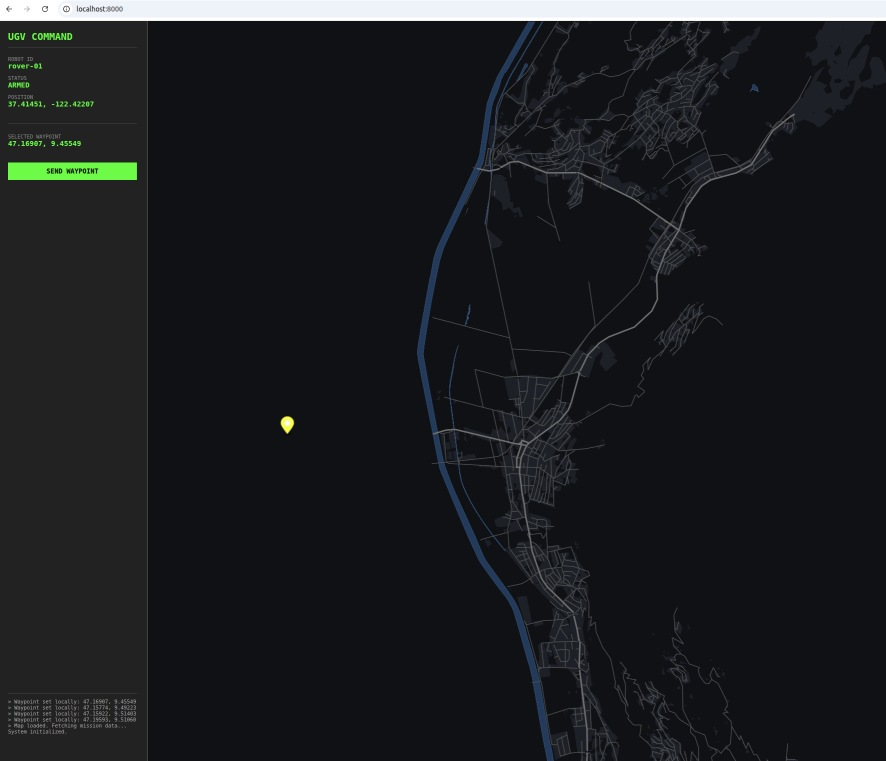

# tactian_gcs_offline_web_UI
web UI with offline maps

### Instructions

Please read the instructions document:  
`https://docs.google.com/document/d/1p3WpGoNI6WZUYLQOHaHPeWLIZ7n8_mqxE67qLpWZmR4/edit?usp=sharing `

### Implementation

A first pass (via Gemini) implementation is shown below:

offline_ui/  
├── main.py                 # The FastAPI Backend & Tile Server  
├── requirements.txt        # Python dependencies  
├── create_dummy_db.py      # Script to create an empty MBTiles file for initial testing  
└── static/                 # Frontend assets  
    ├── index.html          # The UI (HTML/JS/CSS)  
    └── style.json          # MapLibre Style definition  
    
#### Requirements:    
- fastapi  
- uvicorn[standard]  
- pydantic  

#### Setup

##### To test that eveyrting works (without actual real map):
`python create_dummy_db.py`  
`uvicorn main:app --reload`  

Open the Interface: Open your browser to http://localhost:8000.  

##### To run ui with real map (sample Lichtenstein)

###### Go to project root
###### Download a small, valid PBF file (Liechtenstein is standard for testing, small download)
curl -L -o mission-area.osm.pbf https://download.geofabrik.de/europe/liechtenstein-latest.osm.pbf

###### Run Tilemaker
###### Note: We are using $(pwd) so all files (config.json, process.lua, .pbf) must be in the CURRENT folder.
`docker run --rm -v $(pwd):/data ghcr.io/systemed/tilemaker:master --input /data/mission-area.osm.pbf --output /data/osm.mbtiles --config /data/config.json --process /data/process.lua`
  

##### To run ui with real map (sample California)

###### Go to project root
###### Download the Config files again (to be safe)
`curl -L -o config.json https://raw.githubusercontent.com/systemed/tilemaker/master/resources/config-openmaptiles.json`
`curl -L -o process.lua https://raw.githubusercontent.com/systemed/tilemaker/master/resources/process-openmaptiles.lua`

###### Download the Map Data (PBF) 
###### We use a slightly larger area from a different mirror to avoid the empty file issue
###### Note: This file is huge (California). 
`curl -L -o mission-area.osm.pbf "https://download.geofabrik.de/north-america/us/california-latest.osm.pbf"`
`docker run --rm -v $(pwd):/data ghcr.io/systemed/tilemaker:master --input /data/mission-area.osm.pbf --output /data/osm.mbtiles --config /data/config.json --process /data/process.lua`

###### Set home coordinates in index.html:
`center: [-122.42215, 37.41451]`
